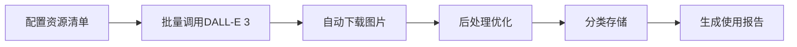

# AIGC美术资源生成工具

Web3 Tycoon游戏的AI美术资源自动生成解决方案，专为黑客松快速开发设计。

## 🚀 快速开始

### 1. 安装依赖
```bash
cd /Users/zero/dev/sui/web3-tycoon/tools/asset-generator
npm install
```

### 2. 配置API密钥
```bash
# 复制环境变量模板
cp .env.example .env

# 编辑.env文件，添加你的OpenAI API Key
# OPENAI_API_KEY=your-api-key-here
```

### 3. 开始生成
```bash
# 生成所有游戏资源
npm run generate

# 生成特定类型资源
npm run generate:tiles    # 地图瓦片
npm run generate:ui       # UI元素  
npm run generate:icons    # 图标集
```

## 📁 工具结构

```
asset-generator/
├── README.md              # 本文档
├── package.json           # 项目依赖
├── .env.example          # 环境变量模板
├── asset_generator.js    # 主生成脚本
├── assets_config.js      # 资源配置列表
├── output/               # 生成的资源输出目录
│   ├── tiles/           # 地图瓦片
│   ├── ui/              # UI元素
│   ├── icons/           # 图标集
│   └── cards/           # 卡片资源
└── logs/                # 生成日志
```

## 🎯 支持的资源类型

### 地图相关
- **地块瓦片**: 40种不同属性的等距地块
- **建筑模型**: 5个等级的房屋/酒店升级
- **特殊地块**: 起点、监狱、机会、税务等

### 角色相关  
- **玩家棋子**: 8-10个不同造型的角色
- **角色动画**: 移动、庆祝、失败等状态

### UI资源
- **卡片设计**: 技能卡、道具卡、事件卡模板
- **按钮界面**: 各种游戏按钮和面板
- **图标集合**: 技能、道具、状态图标
- **HUD元素**: 血条、金币显示、计时器等

### 特效资源
- **粒子纹理**: 升级特效、购买特效
- **光效贴图**: 发光、闪烁效果
- **动画序列**: 金币飞行、骰子滚动

## 🔧 配置说明

### 美术风格设定
项目采用统一的美术风格：
- **整体风格**: Low Poly卡通渲染
- **色彩方案**: 蓝紫科技色 + 金黄财富色
- **设计原则**: 简洁、明亮、易识别

### 提示词模板
```javascript
// 地块建筑模板
const buildingTemplate = {
  base: "大富翁游戏建筑，等距视角，卡通风格，白色背景",
  level1: "简单小房子，木制结构",
  level2: "两层砖房，红色屋顶", 
  level3: "现代公寓，玻璃外墙",
  level4: "高档酒店，豪华设计",
  level5: "摩天大楼，未来科技"
};

// UI元素模板  
const uiTemplate = {
  base: "游戏UI元素，扁平设计，Web3风格",
  colors: "紫色渐变 #6B46C1 到 #9333EA",
  style: "现代简约，发光效果，透明背景"
};
```

## 💡 工作流程

### 自动化生成流程


### 后处理步骤
1. **去背景**: 自动移除白色背景
2. **尺寸优化**: 调整为2的幂次方尺寸
3. **压缩优化**: 保持质量的前提下减小文件大小
4. **分类管理**: 按资源类型自动分类存储

## 📊 成本估算

### API成本
- **DALL-E 3标准质量**: $0.04/张
- **预计总资源**: 100-150张
- **总成本**: $4-6 (完全可控)

### 时间成本
- **设置时间**: 5分钟
- **批量生成**: 20-30分钟 (100张)
- **手工筛选**: 30-60分钟
- **集成到项目**: 15分钟

## 🛠️ 进阶功能

### 批量变体生成
```javascript
// 生成同一建筑的多个角度
const variants = [
  "正面视角，主入口",
  "侧面视角，展示深度", 
  "斜角视角，等距效果"
];
```

### 风格一致性检查
- 自动对比色彩分布
- 检查尺寸比例一致性
- 验证风格统一度

### 与Cocos Creator集成
```javascript
// 自动生成Cocos Creator资源配置
const cocosConfig = {
  "textures": {
    "tiles": "./output/tiles/",
    "ui": "./output/ui/",
    "icons": "./output/icons/"
  }
};
```

## 🔄 替代方案

### 免费方案: Leonardo.ai
如果预算紧张，可使用Leonardo.ai：
- 每天免费150张
- 质量接近DALL-E 3  
- 支持批量生成
- 2-3天完成所有资源

### 混合方案
- **核心资源**: DALL-E 3高质量生成
- **装饰资源**: Leonardo.ai免费生成
- **最终优化**: 简单手工调整

## 📋 资源清单

### 必需资源 (核心40张)
```javascript
const coreAssets = [
  // 基础地块 (8张)
  "起点格子", "监狱格子", "机会格子", "税务格子", 
  "空地", "铁路", "公用事业", "免费停车",
  
  // 建筑等级 (10张) 
  "房屋等级1-5", "酒店等级1-5",
  
  // UI核心 (12张)
  "主菜单背景", "游戏界面背景", "卡片背景框",
  "金币图标", "钻石图标", "设置按钮",
  "暂停按钮", "播放按钮", "关闭按钮",
  "确认按钮", "取消按钮", "帮助按钮",
  
  // 玩家棋子 (10张)
  "棋子1-10: 不同颜色和造型"
];
```

### 扩展资源 (可选60张)
- 装饰元素、动画帧、粒子纹理等

## 🚨 注意事项

### API使用限制
- DALL-E 3: 每分钟5次请求限制
- 脚本已内置延迟处理
- 遇到限制会自动重试

### 质量保证
- 每批生成后人工筛选
- 保留最符合风格的版本
- 建议生成2-3个变体供选择

### 版权说明
- DALL-E 3生成内容商用授权清晰
- 可安全用于比赛和商业项目
- 建议保存生成记录备查

## 🔗 相关链接

- [OpenAI API文档](https://platform.openai.com/docs)
- [Leonardo.ai](https://leonardo.ai) (免费替代)
- [Cocos Creator资源管理](https://docs.cocos.com/creator/manual/zh/)
- [Web3 Tycoon项目文档](../../docs/project-overview.md)

## 📞 技术支持

遇到问题请检查：
1. API密钥是否正确配置
2. 网络连接是否正常
3. 磁盘空间是否充足
4. Node.js版本是否兼容 (建议14+)

开始你的AIGC美术资源生成之旅吧！🎨