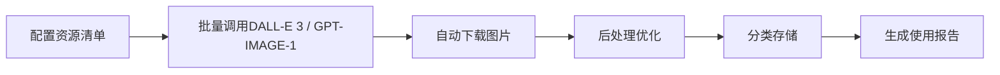

# AIGC美术资源生成工具

Web3 Tycoon游戏的AI美术资源自动生成解决方案，专为黑客松快速开发设计。

## 🚀 快速开始

### 1. 安装依赖
```bash
cd /Users/zero/dev/sui/web3-tycoon/tools/asset-generator
npm install
```

### 2. 配置API密钥
```bash
# 复制环境变量模板
cp .env.example .env

# 编辑.env文件:
# OPENAI_API_KEY=your-openai-api-key-here
# IMAGE_MODEL=dall-e-3        # 可选: gpt-image-1
# IMAGE_SIZE=1024x1024        # 可选: 512x512, 1024x1024 等
# IMAGE_QUALITY=standard      # 或 hd (高清)
# IMAGE_COST_PER_IMAGE=0.02   # 可选: 覆盖成本估算（美元/张）
```

### 3. 开始生成
```bash
# 生成所有游戏资源
npm run generate

# 生成特定类型资源
npm run generate:tiles      # 地图瓦片
npm run generate:ui         # UI元素  
npm run generate:icons      # 图标集
npm run generate:dice       # 骰子贴图 🎲

# 使用 gpt-image-1（1024x1024）以节约成本
npm run generate:gpt
# 仅生成瓦片，且使用 gpt-image-1
npm run generate:gpt:tiles

# 也可直接传入可选参数
# gpt-image-1 的质量可选: low / medium / high
node asset_generator.js --model gpt-image-1 --size 1024x1024 --quality medium --responseFormat url --background transparent --style vivid
```

## 📁 工具结构

```
asset-generator/
├── README.md              # 本文档
├── package.json           # 项目依赖
├── .env.example          # 环境变量模板
├── asset_generator.js    # 主生成脚本
├── assets_config.js      # 资源配置列表
├── output/               # 生成的资源输出目录
│   ├── tiles/           # 地图瓦片
│   ├── ui/              # UI元素
│   ├── icons/           # 图标集
│   ├── cards/           # 卡片资源
│   └── dice/            # 骰子贴图 🎲
└── logs/                # 生成日志
```

## 🎯 支持的资源类型

### 地图相关
- **地块瓦片**: 40种不同属性的等距地块
- **建筑模型**: 5个等级的房屋/酒店升级
- **特殊地块**: 起点、监狱、机会、税务等

### 角色相关  
- **玩家棋子**: 8-10个不同造型的角色
- **角色动画**: 移动、庆祝、失败等状态

### UI资源
- **卡片设计**: 技能卡、道具卡、事件卡模板
- **按钮界面**: 各种游戏按钮和面板
- **图标集合**: 技能、道具、状态图标
- **HUD元素**: 血条、金币显示、计时器等

### 特效资源
- **粒子纹理**: 升级特效、购买特效
- **光效贴图**: 发光、闪烁效果
- **动画序列**: 金币飞行、骰子滚动

### 骰子贴图 🎲
- **Web3创意骰子**: 用BTC和SUI图标代替传统点数
- **3D Cube贴图**: 完整UV展开贴图，可直接应用到Cocos Creator的Cube上
- **单面贴图**: 每个面单独生成，便于精细控制
- **吉卜力风格**: 温暖手绘质感，与游戏整体风格统一

## 🔧 配置说明

### 美术风格设定
项目采用统一的美术风格：
- **整体风格**: 吉卜力风格 (Studio Ghibli)
- **色彩方案**: 温暖自然色调 + 梦幻魔法色彩
- **设计原则**: 温馨、童话、富有情感

### 提示词模板
```javascript
// 吉卜力风格地块建筑模板
const ghibliTemplate = {
  base: "Studio Ghibli style, 吉卜力风格，温暖水彩画风",
  lighting: "soft warm lighting, pastoral countryside",
  level1: "童话小屋，木质结构，烟囱冒烟",
  level2: "乡村别墅，石径花园，窗台花箱", 
  level3: "魔法庄园，藤蔓覆盖，梦幻色彩",
  level4: "童话城堡，塔楼旗帜，浪漫设计",
  level5: "天空之城，悬浮建筑，云朵环绕"
};

// UI元素模板  
const uiTemplate = {
  base: "手绘UI元素，自然曲线设计",
  style: "有机形状，柔和渐变，温馨质感"
};
```

## 💡 工作流程

### 自动化生成流程


### 后处理步骤
1. **去背景**: 自动移除白色背景
2. **尺寸优化**: 调整为2的幂次方尺寸
3. **压缩优化**: 保持质量的前提下减小文件大小
4. **分类管理**: 按资源类型自动分类存储

## 📊 成本估算

### API成本
- **DALL-E 3 Standard**: $0.04/张 (速度快，质量好)
- **DALL-E 3 HD**: $0.08/张 (最高细节)
- **GPT-IMAGE-1 Standard**: ~$0.02/张（更省成本）
- **GPT-IMAGE-1 HD**: ~$0.04/张
- **预计总资源**: 100-150张
- **总成本**: $2-12 (根据模型与质量选择)

### 时间成本
- **设置时间**: 5分钟
- **批量生成**: 
  - Standard质量: 20-30分钟 (100张)
  - HD质量: 30-40分钟 (100张)
- **手工筛选**: 30-60分钟
- **集成到项目**: 15分钟

## 🛠️ 进阶功能

### 批量等级变体生成
```javascript
// 生成同一建筑的不同等级版本
const buildingLevels = [
  "等级1，简单小屋，木质结构",
  "等级2，中型建筑，砖石结构", 
  "等级3，大型建筑，现代设计",
  "等级4，豪华建筑，精美装饰",
  "等级5，地标建筑，标志性设计"
];
```

### 风格一致性检查
- 自动对比色彩分布
- 检查尺寸比例一致性
- 验证风格统一度

### 与Cocos Creator集成
```javascript
// 自动生成Cocos Creator资源配置
const cocosConfig = {
  "textures": {
    "tiles": "./output/tiles/",
    "ui": "./output/ui/",
    "icons": "./output/icons/"
  }
};
```

## 🧾 文件命名与中英映射

- 输出目录: `output/<model>/<category>/...`
- 文件命名: `<category>_<三位序号>_<英文slug>.png`
- slug 规则: 优先使用固定映射；未命中的将按通用规则生成（小写、空格→`-`、移除非字母数字、合并连字符）。

### Tiles 中文 → 英文 slug
```json
{
  "起点地块": "start",
  "监狱地块": "jail",
  "免费停车": "free-parking",
  "去监狱": "go-to-jail",
  "机会地块": "chance",
  "命运地块": "fate",
  "所得税": "income-tax",
  "奢侈税": "luxury-tax",
  "火车站1": "station-1",
  "火车站2": "station-2",
  "火车站3": "station-3",
  "火车站4": "station-4",
  "电力公司": "electric-company",
  "自来水厂": "water-company",
  "红色地产房屋L1": "red-property-house-l1",
  "红色地产房屋L2": "red-property-house-l2",
  "红色地产别墅L3": "red-property-villa-l3",
  "红色地产酒店L4": "red-property-hotel-l4",
  "红色地产摩天楼L5": "red-property-skyscraper-l5",
  "蓝色地产房屋L1": "blue-property-house-l1",
  "蓝色地产房屋L2": "blue-property-house-l2",
  "蓝色地产豪宅L3": "blue-property-mansion-l3",
  "蓝色地产度假村L4": "blue-property-resort-l4",
  "蓝色地产海景大厦L5": "blue-property-seaview-tower-l5",
  "绿色地产房屋L1": "green-property-house-l1",
  "绿色地产房屋L2": "green-property-house-l2",
  "绿色地产庄园L3": "green-property-manor-l3",
  "绿色地产环保酒店L4": "green-property-eco-hotel-l4",
  "绿色地产生态塔L5": "green-property-eco-tower-l5",
  "黄色地产房屋L1": "yellow-property-house-l1",
  "黄色地产房屋L2": "yellow-property-house-l2",
  "黄色地产商务楼L3": "yellow-property-business-tower-l3",
  "黄色地产五星酒店L4": "yellow-property-5star-hotel-l4",
  "黄色地产金融大厦L5": "yellow-property-financial-tower-l5"
}
```

### UI 中文 → 英文 slug
```json
{
  "主菜单背景": "main-menu-background",
  "游戏界面背景": "gameplay-background",
  "设置界面背景": "settings-background",
  "信息面板框架": "info-panel-frame",
  "属性卡片框架": "property-card-frame",
  "交易对话框": "trade-dialog",
  "玩家状态面板": "player-status-panel",
  "排行榜背景": "leaderboard-background",
  "主要操作按钮": "primary-button",
  "次要操作按钮": "secondary-button",
  "危险操作按钮": "danger-button",
  "成功确认按钮": "success-button",
  "加载进度条": "loading-progress-bar",
  "玩家血条UI": "player-health-bar",
  "经验值进度条": "experience-progress-bar",
  "倒计时器界面": "countdown-ui"
}
```

### Icons 中文 → 英文 slug
```json
{
  "金币图标": "coin-icon",
  "钻石图标": "diamond-icon",
  "代币图标": "token-icon",
  "NFT徽章图标": "nft-badge-icon",
  "骰子图标": "dice-icon",
  "卡牌图标": "card-icon",
  "技能书图标": "skill-book-icon",
  "成就奖杯图标": "trophy-icon",
  "设置齿轮图标": "settings-gear-icon",
  "帮助问号图标": "help-question-icon",
  "音效开关图标": "sound-toggle-icon",
  "全屏切换图标": "fullscreen-toggle-icon",
  "好友列表图标": "friends-list-icon",
  "聊天消息图标": "chat-message-icon",
  "排行榜图标": "leaderboard-icon",
  "分享链接图标": "share-link-icon",
  "在线状态图标": "online-status-icon",
  "离线状态图标": "offline-status-icon",
  "加载旋转图标": "loading-spinner-icon",
  "警告提示图标": "warning-icon"
}
```

### Cards 中文 → 英文 slug
```json
{
  "攻击技能卡": "attack-skill-card",
  "防御技能卡": "defense-skill-card",
  "辅助技能卡": "support-skill-card",
  "特殊技能卡": "special-skill-card",
  "消耗道具卡": "consumable-item-card",
  "永久道具卡": "permanent-item-card",
  "装备道具卡": "equipment-item-card",
  "收藏道具卡": "collectible-item-card",
  "机会事件卡": "chance-event-card",
  "命运事件卡": "fate-event-card",
  "危机事件卡": "crisis-event-card",
  "奖励事件卡": "reward-event-card",
  "升级光效纹理": "level-up-effect-texture",
  "购买成功特效": "purchase-success-effect",
  "技能释放特效": "skill-cast-effect",
  "金币收集特效": "coin-collect-effect"
}
```

### Characters 中文 → 英文 slug
```json
{
  "经典绅士棋子": "classic-gentleman-piece",
  "现代商务棋子": "modern-business-piece",
  "科技极客棋子": "tech-geek-piece",
  "时尚达人棋子": "fashionista-piece",
  "运动健将棋子": "athlete-piece",
  "艺术家棋子": "artist-piece",
  "探险家棋子": "explorer-piece",
  "学者教授棋子": "scholar-professor-piece",
  "银行经理NPC": "bank-manager-npc",
  "拍卖师NPC": "auctioneer-npc",
  "律师顾问NPC": "lawyer-advisor-npc",
  "建筑师NPC": "architect-npc"
}
```

## 🔄 替代方案

### 免费方案: Leonardo.ai
如果预算紧张，可使用Leonardo.ai：
- 每天免费150张
- 质量接近DALL-E 3  
- 支持批量生成
- 2-3天完成所有资源

### 混合方案
- **核心资源**: DALL-E 3高质量生成
- **装饰资源**: Leonardo.ai免费生成
- **最终优化**: 简单手工调整

## 📋 资源清单

### 必需资源 (核心45张)
```javascript
const coreAssets = [
  // 基础地块 (8张)
  "起点格子", "监狱格子", "机会格子", "税务格子", 
  "空地", "铁路", "公用事业", "免费停车",
  
  // 建筑等级 (10张) 
  "房屋等级1-5", "酒店等级1-5",
  
  // UI核心 (12张)
  "主菜单背景", "游戏界面背景", "卡片背景框",
  "金币图标", "钻石图标", "设置按钮",
  "暂停按钮", "播放按钮", "关闭按钮",
  "确认按钮", "取消按钮", "帮助按钮",
  
  // 玩家棋子 (8张)
  "棋子1-8: 不同颜色和造型",
  
  // Web3骰子贴图 (7张) 🎲
  "骰子UV展开贴图", "骰子面1-6单独贴图",
  "BTC和SUI图标代替传统点数"
];
```

### 扩展资源 (可选60张)
- 装饰元素、动画帧、粒子纹理等

## 🚨 注意事项

### API使用限制
- DALL-E 3: 每分钟5次请求限制
- 脚本已内置延迟处理
- 遇到限制会自动重试

### 质量保证
- 每批生成后人工筛选
- 保留最符合风格的版本
- 建议生成2-3个变体供选择

### 版权说明
- DALL-E 3生成内容商用授权清晰
- 可安全用于比赛和商业项目
- 建议保存生成记录备查

## 🔗 相关链接

- [OpenAI API文档](https://platform.openai.com/docs)
- [Leonardo.ai](https://leonardo.ai) (免费替代)
- [Cocos Creator资源管理](https://docs.cocos.com/creator/manual/zh/)
- [Web3 Tycoon项目文档](../../docs/project-overview.md)

## 📞 技术支持

遇到问题请检查：
1. API密钥是否正确配置
2. 网络连接是否正常
3. 磁盘空间是否充足
4. Node.js版本是否兼容 (建议14+)

开始你的AIGC美术资源生成之旅吧！🎨